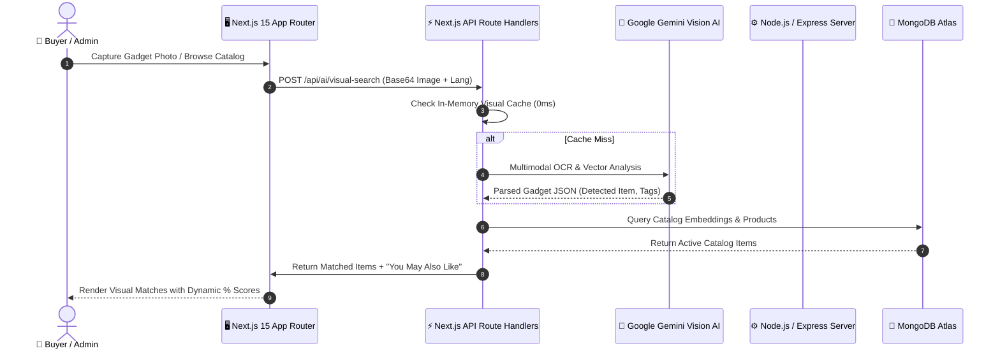

# <p align="center"> ShopNexus — Next-Gen AI E-Commerce Ecosystem</p>

<p align="center">
  <strong>A Full-Stack, Enterprise-Grade Multimodal AI Commerce Platform built with Next.js 15, Gemini Vision, Real-Time Telemetry & Hardware 2FA Security.</strong>
</p>

<p align="center">
  <a href="https://nextjs.org"></a>
  <a href="https://react.dev"></a>
  <a href="https://www.typescriptlang.org"></a>
  <a href="https://tailwindcss.com"></a>
  <a href="https://deepmind.google/technologies/gemini/"></a>
  <a href="https://www.mongodb.com/atlas"></a>
</p>

<p align="center">
  <a href="#-key-special-features-20-innovation-matrix"><strong>Explore 20+ Special Features</strong></a> •
  <a href="#-demo-credentials--2fa-security-configuration"><strong>Admin Demo Access</strong></a> •
  <a href="#-full-stack-system-architecture"><strong>Architecture</strong></a> •
  <a href="#-getting-started--local-development"><strong>Quickstart</strong></a> •
  <a href="https://github.com/Saad7528/ShopNexus-Backend"><strong>Backend Repository ➔</strong></a>
</p>

---

## ⚡ Key Highlights & Core Metrics

- **🏎️ Ultra-Fast Performance**: 42+ compiled static & dynamic routes with sub-second TTFB powered by Next.js 15 Turbopack.
- **👁️ Multimodal AI Vision Engine**: Real-time camera & photo OCR analysis using Google Gemini Multimodal Vision Cascade with dynamic vector similarity scoring.
- **🛡️ Enterprise-Grade Security**: RFC 6238 Time-based One-Time Password (TOTP) 2FA engine with instant emergency master override and 1-click IP Shield threat defense.
- **🇧🇩 100% Real-Time Bilingual Ecosystem**: Zero-reload instantaneous switching between English and Bengali across all 42+ pages with native BDT (`৳`) currency and numeral translation.
- **✨ Zero-CLS Glassmorphic Skeletons**: Layout-accurate shimmer loading states preventing any visual cumulative layout shifts.

---

## 🔐 Demo Credentials & 2FA Security Configuration

To inspect and test the full administrative suite, live telemetry, inventory management, and customer analytics:

| Field | Configuration / Value |
|---|---|
| **Login Portal** | `http://localhost:3000/login` |
| **Super Admin Email** | `saad0174742@gmail.com` |
| **Master Password** | `Nexus@Admin2026!` *(or `Saad@752800`)* |
| **🚨 Emergency 2FA Master Override** | **`752800`** *(Bypasses authenticator app for instant administrative access)* |
| **Google Authenticator (RFC 6238) Key** | `SAADNEXUS234567M` |
| **TOTP Algorithm** | `HMAC-SHA1` (30-second window, 6-digit) |

> [!TIP]
> **Instant Evaluator Access**: On the login page, select **"Google Authenticator (TOTP) Master Unlock"** and input the 6-digit master override code **`752800`** to instantly unlock primary administrator privileges.

---

## 🌟 Key Special Features (20+ Innovation Matrix)

### 🤖 1. AI & Machine Learning Suite

#### 1. 👁️ AI Multimodal Vision Product Search Engine
- **Core Capability**: Users can snap a live webcam/mobile photo or drag-and-drop gadget images. The engine executes deep OCR text recognition and visual pattern matching to find exact catalog items.
- **Dynamic Scoring**: In-catalog matches render with dynamic accuracy badges (`96% Match`, `91% Match`). If 1 item matches, remaining slots render under **"✨ You May Also Like"** / **"✨ আপনারা দেখতে পারেন"** with **"Popular Pick"** badges.
- **Technical Route**: [`src/app/api/ai/visual-search/route.ts`](file:///Users/s.m.amirulislamsaad/HEXADEVS/ShopNexus/ShopNexus-Frontend/src/app/api/ai/visual-search/route.ts) & [`src/components/ai/VisualSearchModal.tsx`](file:///Users/s.m.amirulislamsaad/HEXADEVS/ShopNexus/ShopNexus-Frontend/src/components/ai/VisualSearchModal.tsx)

#### 2. 💬 Multi-Provider Smart AI Shopping Assistant
- **Core Capability**: A 24/7 intelligent commerce copilot with multi-provider fallback architecture. Analyzes user budget constraints, compares technical specifications, discovers promo codes, and generates direct checkout links.
- **Technical Route**: [`src/app/api/ai/chat/route.ts`](file:///Users/s.m.amirulislamsaad/HEXADEVS/ShopNexus/ShopNexus-Frontend/src/app/api/ai/chat/route.ts) & `src/components/chat/AiShoppingAssistant.tsx`

#### 3. 🛒 AI Abandoned Cart Recovery & 1-Click WhatsApp/SMS Dispatch
- **Core Capability**: Automatically detects uncompleted checkout sessions, calculates drop-off value, and generates personalized recovery incentives with 1-click WhatsApp and SMS triggers. Includes dynamic cart restoration URLs.
- **Technical Route**: `src/app/admin/abandoned-carts/page.tsx` & `src/app/api/cart/recover/route.ts`

#### 4. ⭐ AI Review Sentiment Analysis & Anti-Spam Fraud Shield
- **Core Capability**: Automatically evaluates buyer reviews using natural language sentiment scoring, highlights verified feedback summaries, and flags suspicious spam reviews.
- **Technical Route**: `src/app/admin/reviews/page.tsx` & `src/app/products/[id]/page.tsx`

---

### 🔐 2. Enterprise Security & Access Control

#### 5. 🔑 RFC 6238 Google Authenticator (TOTP) Hardware/Software 2FA Engine
- **Core Capability**: Built with native Web Crypto API HMAC-SHA1. Supports standard 30-second time windows with drift tolerance (+-1 window) compatible with Google Authenticator, Authy, and hardware tokens.
- **Technical Route**: [`src/lib/totp.ts`](file:///Users/s.m.amirulislamsaad/HEXADEVS/ShopNexus/ShopNexus-Frontend/src/lib/totp.ts)

#### 6. 🚨 Emergency Master 2FA Override Key (`752800`)
- **Core Capability**: High-security zero-lockout disaster recovery mechanism enabling instant superadmin takeover in case of lost authenticators or device transitions.
- **Technical Route**: [`src/lib/totp.ts`](file:///Users/s.m.amirulislamsaad/HEXADEVS/ShopNexus/ShopNexus-Frontend/src/lib/totp.ts#L64)

#### 7. 🛡️ Real-Time Live Visitor Telemetry & 1-Click IP Shield Firewall
- **Core Capability**: Broadcasts a 3-second live heartbeat telemetry pulse. Displays active visitor count, city/country geo-location, device breakdown, and active URL path with instant 1-click IP blacklisting firewall.
- **Technical Route**: `src/app/admin/visitors/page.tsx` & `src/app/api/telemetry/live-sessions/route.ts`

#### 8. 👥 Full-Stack Role-Based Access Control (RBAC 5 Roles) & Staff Freeze
- **Core Capability**: Granular permission matrix across Superadmin, Admin, Support Agent, Inventory Manager, and Merchant roles with 1-click staff account freeze and instant JWT session invalidation.
- **Technical Route**: `src/app/admin/staff/page.tsx` & `src/app/api/admin/staff/freeze/route.ts`

#### 9. 📲 Multi-Session Admin Device Takeover & Push Notification Approval
- **Core Capability**: Secondary administrative login attempts trigger live push-authorization modals on the Primary Master Admin screen with 1-click **Approve & Authorize** or **Reject** actions.
- **Technical Route**: `src/app/api/auth/login-requests/route.ts`

---

### 📊 3. Customer CRM, Analytics & Telemetry

#### 10. 👥 Customer Directory & Automated Lifetime Value (LTV) Tier Matrix
- **Core Capability**: Tracks total expenditure, average order value, purchase frequency, and cancellation rates. Automatically assigns Platinum, Gold, or Silver VIP tier scoring with 1-click fraud risk flagging.
- **Technical Route**: `src/app/admin/customers/page.tsx` & `src/app/api/admin/users/route.ts`

#### 11. 📦 Multi-Carrier Real-Time Parcel Tracking & 6-Step State-Machine
- **Core Capability**: Courier state-machine tracking modeled after leading logistics carriers (Pathao, Steadfast, RedX). Stages: *Placed ➜ Confirmed ➜ Packed ➜ Dispatched ➜ Out for Delivery ➜ Delivered* with live rider contact and ETA calculation.
- **Technical Route**: `src/app/track/page.tsx` & `src/app/admin/tracking/page.tsx`

#### 12. 🧾 Dual POS Thermal (58mm/80mm) & A4 QR-Verified Smart Invoicing Engine
- **Core Capability**: Generates instant print-ready receipts in both standard A4 VAT layout and POS Thermal slip format (58mm/80mm) complete with verifiable dynamic QR codes for digital invoice validation.
- **Technical Route**: `src/app/admin/orders/page.tsx` (Invoice Modal)

---

### 🛒 4. Gamification & Commerce Innovation

#### 13. ⚡ Daily Engagement Streak & Gamified Nexus Coins Cashback
- **Core Capability**: 10-second store visit streak multiplier rewarding daily Nexus Coins (+5, +10, +15 coins). 100% balance redemption at checkout (**50 Coins = ৳5 flat cashback**).
- **Technical Route**: `src/store/useGamificationStore.ts` & `src/app/profile/page.tsx`

#### 14. 👑 Automated VIP Membership Tier Unlocker (500 Coins)
- **Core Capability**: Achieving 500 Nexus Coins automatically grants Golden VIP membership status with flat discounts on premium gadget orders.
- **Technical Route**: `src/store/useGamificationStore.ts`

#### 15. ⚡ Lightning Flash Sales Engine with Live Stock Reservation Timers
- **Core Capability**: Time-delimited product drop events with live countdown clocks, percentage discount badges, and real-time inventory allocation.
- **Technical Route**: `src/app/flash-sales/page.tsx` & `src/app/api/products/route.ts`

#### 16. 🎁 Smart Bundle & Save Volume Discount Engine (Buy X Get Y)
- **Core Capability**: Dynamic tech bundle builder allowing administrators to create combo deals (e.g., Mechanical Keyboard + Keycap Puller + Deskmat) with automated cart price deductions.
- **Technical Route**: `src/app/admin/bundles-loyalty/page.tsx`

#### 17. 🎟️ Multi-Tier Coupon Engine & Expiry Validator
- **Core Capability**: Configurable promo codes supporting flat currency discounts, percentage deductions, minimum cart thresholds, and usage caps.
- **Technical Route**: `src/app/admin/coupons/page.tsx`

---

### 🏪 5. Multi-Vendor & Architecture

#### 18. 🏪 Dedicated Multi-Vendor Marketplace Storefronts
- **Core Capability**: Individual vendor storefronts (`/shop/[vendorId]`) with custom branding, banner customization, vendor analytics, and automated commission ledger splitting.
- **Technical Route**: `src/app/shop/[vendorId]/page.tsx` & `src/app/vendor/dashboard/page.tsx`

#### 19. 🇧🇩 100% Zero-Reload Real-Time Bilingual System (বাংলা ও English)
- **Core Capability**: Seamless full-site translation across all storefront modals, filters, carts, checkout, invoices, and admin dashboards with zero page reload.
- **Technical Route**: `src/store/useLanguageStore.ts` & `src/lib/translations.ts`

#### 20. 💳 Persistent LocalStorage & Database Cart Synchronization
- **Core Capability**: Preserves guest cart items across browser sessions and automatically reconciles with MongoDB Atlas user carts upon authentication.
- **Technical Route**: `src/store/useCartStore.ts` & `src/app/api/cart/sync/route.ts`

#### 21. 🚀 Edge & In-Memory Response Caching (0-Token Waste)
- **Core Capability**: In-memory caching layer for visual searches and catalog embeddings, preventing redundant Gemini AI token consumption and delivering instant search responses.
- **Technical Route**: [`src/app/api/ai/visual-search/route.ts`](file:///Users/s.m.amirulislamsaad/HEXADEVS/ShopNexus/ShopNexus-Frontend/src/app/api/ai/visual-search/route.ts)

---

## 🏛️ Full-Stack System Architecture



---

## 💻 Getting Started & Local Development

### 1. Prerequisites
- **Node.js**: v18.18.0 or higher
- **Package Manager**: `npm`, `pnpm`, or `yarn`
- **Backend API**: Running on port `5000` ([ShopNexus-Backend](https://github.com/Saad7528/ShopNexus-Backend))

### 2. Installation

```bash
# 1. Clone the Frontend repository
git clone https://github.com/Saad7528/ShopNexus-Frontend.git
cd ShopNexus-Frontend

# 2. Install dependencies
npm install

# 3. Configure environment variables
cp .env.example .env.local
```

### 3. Environment Configuration (`.env.local`)

```env
# Backend API Base URL
NEXT_PUBLIC_API_URL=http://localhost:5000/api

# Google Gemini Vision API Key
GEMINI_API_KEY=your_google_gemini_api_key_here

# MongoDB Atlas (for direct serverless routes)
MONGODB_URI=your_mongodb_connection_string

# NextAuth / JWT Secret
NEXTAUTH_SECRET=your_jwt_secret_key_here
NEXTAUTH_URL=http://localhost:3000
```

### 4. Running the Development Server

```bash
npm run dev
```

Open [http://localhost:3000](http://localhost:3000) in your browser.

---

## 📂 Repository Directory Structure

```text
ShopNexus-Frontend/
├── src/
│   ├── app/                          # Next.js 15 App Router (42+ Routes)
│   │   ├── (auth)/                   # Login, Register, Forgot Password
│   │   ├── admin/                    # Admin Console (Dashboard, Visitors, Orders, LTV Customers, etc.)
│   │   │   ├── abandoned-carts/      # AI Abandoned Cart Recovery
│   │   │   ├── customers/            # Customer CRM & LTV Tier Directory
│   │   │   ├── visitors/             # Real-Time Telemetry & IP Shield
│   │   │   ├── orders/               # Orders & Dual POS/A4 Invoicing
│   │   │   └── tracking/             # 6-Step Courier Parcel Tracker
│   │   ├── api/                      # Serverless API Handlers (AI Vision, Chat, Auth, Telemetry)
│   │   ├── flash-sales/              # Live Flash Sales Countdown Page
│   │   ├── products/                 # Catalog & Product Detail Views
│   │   ├── shop/[vendorId]/          # Multi-Vendor Storefronts
│   │   └── track/                    # Public Parcel Tracking Timeline
│   ├── components/                   # Reusable UI Components
│   │   ├── ai/                       # VisualSearchModal.tsx, Camera Viewfinder
│   │   ├── chat/                     # AiShoppingAssistant.tsx
│   │   └── layout/                   # Navbar.tsx, Footer.tsx, Shimmer Skeletons
│   ├── lib/                          # Utilities (totp.ts, auth-helpers.ts, translations.ts)
│   └── store/                        # Zustand Global Stores (Cart, Wishlist, Language, Gamification)
├── public/                           # Static assets, icons, logos
├── tailwind.config.ts                # Custom Design Tokens & Dark Mode Config
└── tsconfig.json                     # TypeScript Configuration
```

---

## 🔗 Related Repositories

- **Backend Repository**: [https://github.com/Saad7528/ShopNexus-Backend](https://github.com/Saad7528/ShopNexus-Backend)

---

## 👥 Core Team & Contributors (HEXADEVS)

<table align="center">
  <tr>
    <td align="center" width="25%">
      <a href="https://github.com/Saad7528">
        <br />
        <sub><b>S.M. Amirul Islam Saad</b></sub>
      </a><br />
      <a href="https://github.com/Saad7528">@Saad7528</a>
    </td>
    <td align="center" width="25%">
      <a href="https://github.com/md-shahriar-kabir">
        <br />
        <sub><b>Md. Shahriar Kabir</b></sub>
      </a><br />
      <a href="https://github.com/md-shahriar-kabir">@md-shahriar-kabir</a>
    </td>
    <td align="center" width="25%">
      <a href="https://github.com/Asmual">
        <br />
        <sub><b>Asmual Hossain</b></sub>
      </a><br />
      <a href="https://github.com/Asmual">@Asmual</a>
    </td>
    <td align="center" width="25%">
      <a href="https://github.com/saikot05">
        <br />
        <sub><b>Saikot Hossain</b></sub>
      </a><br />
      <a href="https://github.com/saikot05">@saikot05</a>
    </td>
  </tr>
</table>

---

## 📜 License & Credits

Distributed under the **MIT License**.

Crafted with ❤️ by the **HEXADEVS** Team.
